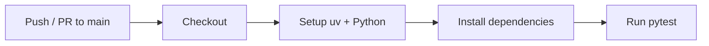
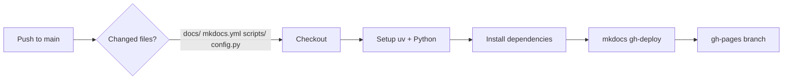

# CI/CD Workflows

The project uses GitHub Actions for continuous integration and documentation deployment.

## Tests

**File:** `.github/workflows/tests.yml`

Runs the full test suite on every push to `main` and on pull requests.

### Triggers

| Event | Branch |
|---|---|
| `push` | `main` |
| `pull_request` | `main` |

### Steps

1. **Checkout** — clone the repository
2. **Setup uv** — install the `uv` package manager via `astral-sh/setup-uv`
3. **Set up Python** — install the Python version from `pyproject.toml`
4. **Install dependencies** — `uv sync --dev` installs all dependencies including test tools
5. **Run tests** — `uv run python -m pytest -v tests`

## Documentation Deployment

**File:** `.github/workflows/docs.yml`

Builds and deploys the MkDocs site to GitHub Pages whenever relevant files change on `main`.

### Triggers

Pushes to `main` that modify any of:

- `docs/**`
- `mkdocs.yml`
- `scripts/**`
- `config.py`

Source files are included because API documentation is auto-generated from docstrings.

### Steps

1. **Checkout** — clone the repository
2. **Setup uv** — install the `uv` package manager
3. **Set up Python** — install the Python version from `pyproject.toml`
4. **Install dependencies** — `uv sync --dev`
5. **Build and deploy** — `mkdocs gh-deploy --force` builds the static site and pushes it to the `gh-pages` branch

### GitHub Pages Setup

After the first successful workflow run, enable Pages in your repository:

1. Go to **Settings > Pages**
2. Set **Source** to **Deploy from a branch**
3. Select **`gh-pages`** / **`/ (root)`**
4. The site will be available at `https://jcaillaux.github.io/spotlight-ingest/`
