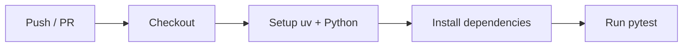
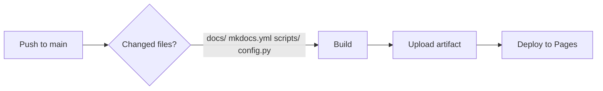

# CI/CD Workflows

The project uses GitHub Actions for continuous integration and documentation deployment.

## Tests

[](https://github.com/jcaillaux/spotlight-ingest/actions/workflows/tests.yml)

**File:** `.github/workflows/tests.yml`

Runs the full test suite on every push to `main`/`staging` and on pull requests to `staging`.



### Triggers

| Event | Branch |
|---|---|
| `push` | `main`, `staging` |
| `pull_request` | `staging` |

### Steps

1. **Checkout** — clone the repository
2. **Setup uv** — install the `uv` package manager via `astral-sh/setup-uv`
3. **Set up Python** — install the Python version from `pyproject.toml`
4. **Install dependencies** — `uv sync --dev`
5. **Run tests** — `uv run python -m pytest -v tests`

## Documentation Deployment

[](https://jcaillaux.github.io/spotlight-ingest/)

**File:** `.github/workflows/docs.yml`

Builds the MkDocs site and deploys it to GitHub Pages using the official Actions deployment.



### Triggers

Pushes to `main` that modify any of:

- `docs/**`
- `mkdocs.yml`
- `scripts/**` — API docs are auto-generated from docstrings
- `config.py`

### Dependency Group

The workflow installs only the `docs` dependency group, avoiding heavy packages like `torch` and `transformers`:

```bash
uv sync --only-group docs
```

This group is defined in `pyproject.toml`:

```toml
[dependency-groups]
docs = [
    "mkdocs>=1.6.1",
    "mkdocs-material>=9.7.6",
    "mkdocstrings[python]>=1.0.4",
]
```

### Steps

1. **Checkout** — clone the repository
2. **Setup uv** — install the `uv` package manager
3. **Set up Python** — install the Python version from `pyproject.toml`
4. **Install docs dependencies** — `uv sync --only-group docs`
5. **Build docs** — `uv run mkdocs build`
6. **Upload artifact** — `actions/upload-pages-artifact`
7. **Deploy** — `actions/deploy-pages` publishes to GitHub Pages

### GitHub Pages Setup

Pages is configured to deploy from **GitHub Actions** (not from a branch). This is set in **Settings > Pages > Source > GitHub Actions**.

## Branch Protection

The repository uses GitHub rulesets to enforce the branching workflow:

| Branch | Rules |
|---|---|
| `staging` | No direct push, PRs only, tests must pass |
| `main` | No direct push, PRs only, tests must pass |

### Workflow


